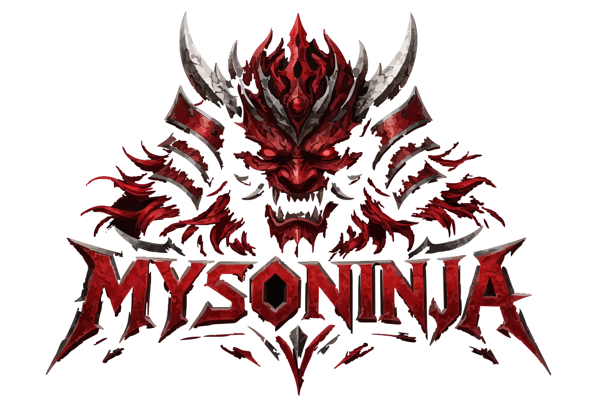

<!-- 
  ═══════════════════════════════════════════════════════════════
  MYSŌNINJA — QUANTUM RED TEAM ARSENAL
  ═══════════════════════════════════════════════════════════════
  Place your logo here (recommended: 800x200 PNG or SVG)
  ═══════════════════════════════════════════════════════════════
-->

<p align="center">
  <!-- LANDSCAPE LOGO SPACE — 800x200 -->
  <!-- Replace the URL below with your logo image -->
  
</p>

<p align="center">
  <strong>🗡️ QUANTUM RED TEAM WARFARE PLATFORM — STANDALONE ARSENAL 🗡️</strong><br>
  <em>"In the shadows we operate, with honor we compete."</em>
</p>

<p align="center">
  
  
  
  
</p>

---

## 📡 OVERVIEW

**MYSŌNINJA** is a fully self-contained red team arsenal — no cloud, no API keys, no external dependencies. Every module is built to function offline, in the field, or behind enemy lines.

It implements a complete **kill chain**:

```

RECON → WEAPONIZE → DELIVER → EXPLOIT → PERSIST → C2 → EXFIL → COVER

```

Built for operators who need real capability without the bloat.

---

## ⚡ CORE FEATURES

| Module | Capability |
|--------|------------|
| **🎯 Recon** | DNS enumeration, port scanning, subdomain discovery, service fingerprinting |
| **💀 Payloads** | Reverse shells (bash, Python, PowerShell, CMD), obfuscated, multi-platform |
| **⚡ Exploits** | EternalBlue (MS17-010), SMB relay, web vulnerabilities (SQLi, RCE, LFI) |
| **🏴 Persistence** | Registry keys, scheduled tasks, services, WMI, startup folders |
| **📡 C2** | Multi-session TCP listener with heartbeat, encrypted command channel |
| **🎣 Phishing** | Dynamic page generator with tracking pixels, credential capture, real-time alerts |
| **📶 Wireless** | WiFi scanning, deauth attacks, handshake capture, hashcat integration |
| **🖥️ Terminal** | Full shell access directly from the War Room UI |
| **🔐 Crypto** | AES-256, ChaCha20, XOR obfuscation for payloads and sessions |
| **🌐 Web UI** | Real-time dashboard with SocketIO, terminal emulation, module controls |

---

## 🚀 QUICK START

### Installation

```bash
# Clone the repository
git clone https://github.com/anonymous-beta/MYSONINJA
cd MYSONINJA

# Run the installer (auto-detects Linux/Termux)
chmod +x install.sh
./install.sh

# Launch the arsenal
python3 run.py
```

Access

```
🌐 War Room: http://127.0.0.1:5000
🔑 Default port: 5000
```

---

🧩 MODULE BREAKDOWN

Reconnaissance

```bash
# DNS enumeration
POST /api/recon/dns
{ "domain": "target.com" }

# Port scanning
POST /api/recon/ports
{ "host": "192.168.1.1" }

# Subdomain discovery
POST /api/recon/subdomain
{ "domain": "target.com" }
```

Payload Generation

```bash
# Generate reverse shells (all platforms)
POST /api/payloads/reverse_shell
{ "host": "127.0.0.1", "port": 4444 }

# Output: bash, python, powershell, cmd variants
```

Command & Control

```bash
# Start TCP listener
POST /api/c2/start
{ "host": "0.0.0.0", "port": 4444 }

# Get active sessions
GET /api/c2/sessions

# Send command to session
POST /api/c2/send
{ "session_id": "...", "command": "whoami" }
```

Phishing Campaigns

```bash
# Generate campaign
POST /api/campaigns
{
  "platform": "facebook|gmail|microsoft|paypal",
  "target_email": "victim@example.com",
  "message": "Custom alert text"
}

# Campaign URL
http://127.0.0.1:5000/capture/{campaign_id}
```

Exploits

```bash
# Check EternalBlue vulnerability
POST /api/exploit/eternalblue/check
{ "host": "192.168.1.10" }

# Add persistence (Windows)
POST /api/persistence/registry
{
  "name": "update",
  "command": "C:\\payload.exe",
  "key": "HKCU"
}
```

---

🖥️ WAR ROOM UI

The web interface provides a terminal-style command center with:

· Real-time logging via SocketIO
· Module panels for quick access
· Session management for active C2 connections
· Capture alerts when phishing credentials are submitted
· Command execution directly from the browser

https://via.placeholder.com/800x400/0a0a12/7a4a9a?text=War+Room+UI+Preview

---

🔧 REQUIREMENTS

· Python 3.8+
· Linux / Windows / Termux
· Nmap (optional, for advanced scanning)
· Aircrack-ng (optional, for wireless attacks)

All Python dependencies are handled by install.sh.

---

📁 PROJECT STRUCTURE

```
MYSONINJA/
├── src/
│   ├── core/              # Engine, database, crypto, obfuscator
│   ├── modules/           # Recon, payloads, exploits, persistence, C2, phishing, wireless
│   ├── web/               # Flask app, routes, static assets
│   ├── templates/         # War Room HTML
│   └── utils/             # Banner, helpers
├── data/                  # Encrypted SQLite database
├── campaigns/             # Generated phishing pages
├── logs/                  # Encrypted session logs
├── requirements.txt
├── install.sh
├── run.py
└── README.md
```

---

🛡️ SECURITY & ETHICS

MYSŌNINJA is designed for:

· Authorized penetration testing
· Red team exercises
· Security research and education
· CTF competitions

DO NOT use this tool on systems you do not own or have explicit permission to test.

The creators are not responsible for misuse. Use responsibly.

---

👥 CREDITS

MYSŌNINJA was forged by:

· MysteryAK — AI & Quantum Computing Specialist
· (Anonymous-beta) — Red Team Operations Expert

---

📜 LICENSE

MIT License — see LICENSE for details.

---

<p align="center">
  <strong>⚔️ In the shadows we operate, with honor we compete. ⚔️</strong>
</p>

<p align="center">
  <sub>MYSŌNINJA v4.0 — STANDALONE ARSENAL</sub>
</p>
